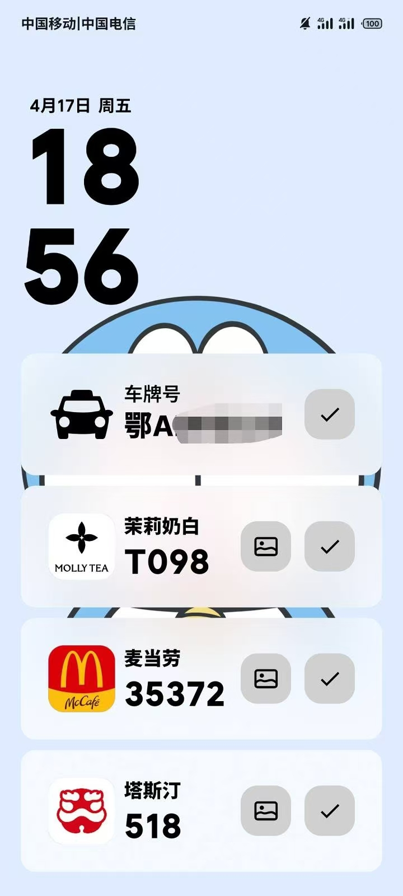
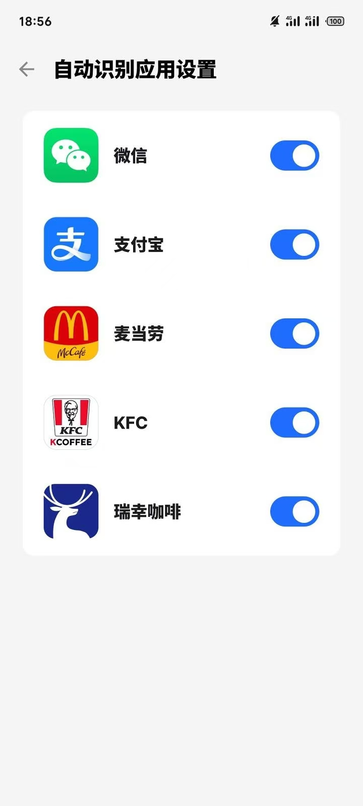

<h3 align='center'>OrderAgents 物品码识别上岛APP</h3>

包名（`applicationId`）：`com.yxmax.orderagents`

## APP功能图

## 功能

1. 支持以下应用的自动OCR识别:
- 微信(`com.tencent.mm`),
- 支付宝(`com.eg.android.AlipayGphone`),
- 麦当劳(`com.mcdonalds.gma.cn`),
- 肯德基(`com.yek.android.kfc.activitys`),
- 瑞幸咖啡(`com.lucky.luckyclient`),
- 菜鸟(`com.cainiao.wireless`),
- 哈啰(`com.jingyao.easybike`),
- 滴滴出行(`com.sdu.didi.psnger`),
- 花小猪打车(`com.huaxiaozhu.rider`)

2. 其余应用可通过 生成快捷方式 并放入Flyme的应用小窗中进行快捷的截图识别 / 点击控制中心磁贴进行快捷截图识别
3. 识别OCR文字特征和取餐码特征 显示对应的品牌
4. 现已支持以下品牌的识别和图片展示:
- 快餐品牌:
  - 塔斯汀
  - 麦当劳
  - 肯德基
  - 汉堡王
- 奶茶品牌:
  - 喜茶
  - 茶百道
  - 霸王茶姬
  - 沪上阿姨
  - 茶理宜世
  - 蜜雪冰城
  - CoCo
  - 库迪咖啡
  - 瑞幸咖啡
  - 一点点
  - 爷爷不泡茶
  - 古茗
  - Manner
  - 茉莉奶白
  - LINLEE
- 取件码品牌:
  - 菜鸟驿站
  - 妈妈驿站
  - 丰巢
  - 兔喜生活
- 车牌号识别:
  - 滴滴出行
  - 哈啰
  - 花小猪
 
更多功能正在开发中...

## 使用

1. 安装APP后, 点击右上角的 `设置` 按钮, 按照顺序给予权限并打开 `无障碍服务`
2. 点击APP设置中的 `创建快捷方式` 至桌面 并在Flyme应用小窗的功能页中添加该APP的截图识别快捷方式即可快速截图识别
3. 或在控制中心点击 `物品码识别` 磁贴进行快速截图识别

## 致谢

- 感谢 [Flyme-Live-Notification-Demo](https://github.com/Ruyue-Kinsenka/Flyme-Live-Notification-Demo) 提供的 Flyme 实况通知调用参考.
- 感谢 [Pinme](https://github.com/BryceWG/Pinme) 提供的 快捷方式和OCR识别 方案参考
